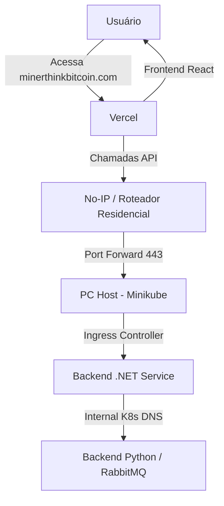

# Guia de Deployment e Infraestrutura

Este documento detalha a arquitetura de hospedagem e o fluxo de rede do ThinkBitcoin Frontend, integrando serviços em nuvem (Vercel) com serviços locais (Minikube).

## 1. Visão Geral da Arquitetura



## 2. Configuração do Domínio (No-IP)

O domínio `minerthinkbitcoin.com` é utilizado para expor o seu Backend residencial para a Vercel.

- **DNS:** O No-IP deve estar configurado para atualizar automaticamente o IP da sua residência.
- **Port Forwarding:** No seu roteador, as portas **80 (HTTP)** e **443 (HTTPS)** devem estar abertas e apontadas para o IP local da máquina que roda o Minikube.

## 3. Configuração do Minikube (Ingress)

Para que o tráfego externo chegue ao seu serviço dentro do Kubernetes local:

1. **Habilite o Ingress:**
   ```bash
   minikube addons enable ingress
   ```

2. **Ingress Resource:**
   Crie um arquivo `ingress.yaml` (exemplo) para mapear o tráfego:
   ```yaml
   apiVersion: networking.k8s.io/v1
   kind: Ingress
   metadata:
     name: thinkbitcoin-ingress
     annotations:
       nginx.ingress.kubernetes.io/rewrite-target: /
   spec:
     rules:
     - host: minerthinkbitcoin.com
       http:
         paths:
         - path: /api
           pathType: Prefix
           backend:
             service:
               name: dotnet-api-service
               port:
                 number: 5000
   ```

## 4. Pipeline de CI/CD (Azure DevOps)

Localizado em `devops/azure-pipelines.yml`, o pipeline automatiza o deploy para a Vercel.

### Variáveis Necessárias (Variable Group: `thinkbitcoin-secrets`)

| Variável | Descrição |
|----------|-----------|
| `VERCEL_TOKEN` | Token gerado em Account Settings > Tokens na Vercel. |
| `VERCEL_ORG_ID` | Encontrado em Team Settings ou Account Settings (ID). |
| `VERCEL_PROJECT_ID` | Encontrado em Project Settings > General na Vercel. |
| `PROD_API_URL` | URL do Backend (`https://minerthinkbitcoin.com`). |

## 5. Segurança e CORS

Como o Frontend e o Backend estão em domínios diferentes, o Backend **DEVE** habilitar o CORS.

Exemplo de configuração no `.NET (Program.cs)`:

```csharp
builder.Services.AddCors(options => {
    options.AddDefaultPolicy(policy => {
        policy.WithOrigins("https://thinkbitcoin-front.vercel.app") // Substitua pela URL da Vercel
              .AllowAnyHeader()
              .AllowAnyMethod()
              .AllowCredentials(); // Essencial para o SignalR
    });
});
```

## 6. SSL e HTTPS

A Vercel exige que a API seja acessada via **HTTPS**.
- Se você usa o No-IP direto, precisará de um certificado no Ingress (ex: via Cert-Manager).
- **Recomendação:** Use um **Cloudflare Tunnel** para expor seu serviço local, pois ele fornece HTTPS automático e dispensa a abertura de portas no roteador.
