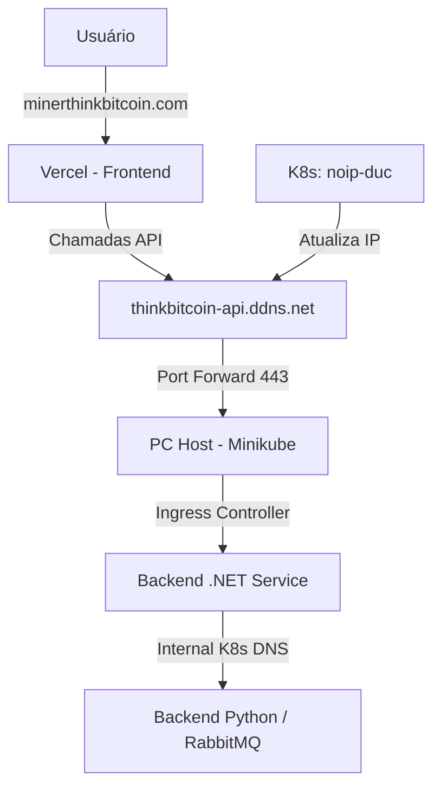

# Guia de Deployment e Infraestrutura

Este documento detalha a arquitetura de hospedagem e o fluxo de rede do ThinkBitcoin-Front, integrando serviços em nuvem (Vercel) com serviços locais (Minikube).

## 1. Visão Geral da Arquitetura



## 2. Configuração de Domínios (No-IP)

Para evitar custos extras e garantir estabilidade, o projeto usa dois endereços:

- **Frontend (minerthinkbitcoin.com):** Apontado para a Vercel via Registro A (`76.76.21.21`).
- **Backend (thinkbitcoin-api.ddns.net):** Um hostname gratuito do No-IP usado para Dynamic DNS, apontando para o seu IP residencial.

### Dynamic DNS com Docker no Kubernetes
Para manter o IP do backend sempre atualizado, rodamos o No-IP DUC dentro do Minikube:
1.  Configure suas credenciais no arquivo `devops/deploy/noip-duc.yaml`.
2.  Aplique o manifesto:
    ```bash
    kubectl apply -f devops/deploy/noip-duc.yaml
    ```

## 3. Configuração do Minikube (Ingress)

O tráfego que chega via `thinkbitcoin-api.ddns.net` deve ser direcionado ao seu serviço .NET:

```yaml
apiVersion: networking.k8s.io/v1
kind: Ingress
metadata:
  name: thinkbitcoin-ingress
  namespace: thinkbitcoin
spec:
  rules:
  - host: thinkbitcoin-api.ddns.net
    http:
      paths:
      - path: /
        pathType: Prefix
        backend:
          service:
            name: dotnet-api-service
            port:
              number: 5000
```

## 4. Pipeline de CI/CD (Azure DevOps)

O pipeline em `devops/azure-pipelines-front-deploy-vercel.yml` automatiza o deploy.

### Variáveis (Variable Group: `thinkbitcoin-secrets`)

| Variável | Valor sugerido |
|----------|-----------|
| `VERCEL_TOKEN` | Token de API da Vercel |
| `PROD_API_URL` | `https://thinkbitcoin-api.ddns.net` |
| `VERCEL_PROJECT_ID` | ID do projeto na Vercel |
| `VERCEL_ORG_ID` | ID da organização na Vercel |

## 5. Segurança e CORS

O Backend .NET deve permitir chamadas vindas da Vercel:

```csharp
builder.Services.AddCors(options => {
    options.AddDefaultPolicy(policy => {
        policy.WithOrigins("https://minerthinkbitcoin.com")
              .AllowAnyHeader()
              .AllowAnyMethod()
              .AllowCredentials();
    });
});
```

## 6. SSL e HTTPS
A Vercel fornece HTTPS automático para o Frontend. Para o Backend local:
- Recomenda-se o uso de **Cloudflare Tunnel** ou **Let's Encrypt** (via cert-manager) para garantir que o navegador não bloqueie chamadas de "conteúdo misto" (Site HTTPS chamando API HTTP).
