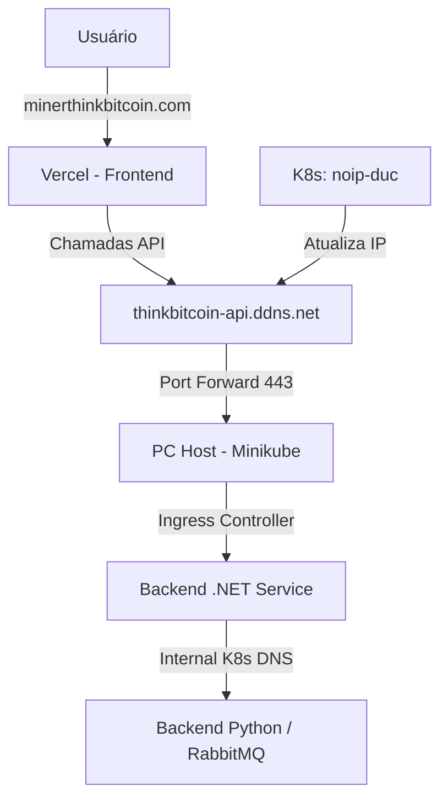

# Guia de Deployment e Infraestrutura

Este documento detalha a arquitetura de hospedagem e o fluxo de rede do ThinkBitcoin-Front, integrando serviços em nuvem (Vercel) com serviços locais (Minikube).

## 1. Visão Geral da Arquitetura



## 2. Configuração de Domínios (No-IP)

Para evitar custos extras e garantir estabilidade, o projeto usa dois endereços:

- **Frontend (minerthinkbitcoin.com):** Apontado para a Vercel via Registro A (`76.76.21.21`).
- **Backend (thinkbitcoin-api.ddns.net):** Um hostname gratuito do No-IP usado para Dynamic DNS, apontando para o seu IP residencial.

### Dynamic DNS com Docker no Kubernetes
Para manter o IP do backend sempre atualizado, rodamos o No-IP DUC dentro do Minikube:
1.  Configure suas credenciais no arquivo `devops/deploy/noip-duc.yaml`.
2.  Aplique o manifesto:
    ```bash
    kubectl apply -f devops/deploy/noip-duc.yaml
    ```

## 3. Configuração do Minikube (Ingress)

O tráfego que chega via `thinkbitcoin-api.ddns.net` deve ser direcionado ao seu serviço .NET:

```yaml
apiVersion: networking.k8s.io/v1
kind: Ingress
metadata:
  name: thinkbitcoin-ingress
  namespace: thinkbitcoin
spec:
  rules:
  - host: thinkbitcoin-api.ddns.net
    http:
      paths:
      - path: /
        pathType: Prefix
        backend:
          service:
            name: dotnet-api-service
            port:
              number: 5000
```

## 4. Pipeline de CI/CD (Azure DevOps)

O pipeline em `devops/azure-pipelines-front-deploy-vercel.yml` automatiza o deploy.

### Variáveis (Variable Group: `thinkbitcoin-secrets`)

| Variável | Valor sugerido |
|----------|-----------|
| `VERCEL_TOKEN` | Token de API da Vercel |
| `PROD_API_URL` | `https://thinkbitcoin-api.ddns.net` |
| `VERCEL_PROJECT_ID` | ID do projeto na Vercel |
| `VERCEL_ORG_ID` | ID da organização na Vercel |

## 5. Segurança e CORS

O Backend .NET deve permitir chamadas vindas da Vercel:

```csharp
builder.Services.AddCors(options => {
    options.AddDefaultPolicy(policy => {
        policy.WithOrigins("https://minerthinkbitcoin.com")
              .AllowAnyHeader()
              .AllowAnyMethod()
              .AllowCredentials();
    });
});
```

### Cabeçalhos de segurança (`src/vercel.json`)

A Vercel aplica os cabeçalhos declarados em `src/vercel.json` a toda resposta.
Estão **em vigor**: `Strict-Transport-Security`, `X-Content-Type-Options`,
`X-Frame-Options: DENY`, `Referrer-Policy` e `Permissions-Policy`.

A **CSP está em modo `Report-Only`**, de propósito. A política precisa liberar
três origens externas que o app realmente usa:

| Origem | Por quê | Diretiva |
|--------|---------|----------|
| `https://www.gstatic.com` | loader do Google Charts (GeoHeatmap) | `script-src`, `img-src`, `connect-src` |
| `https://fonts.googleapis.com` | `@import` das fontes em `src/App.css` | `style-src` |
| `https://fonts.gstatic.com` | arquivos `.woff2` das mesmas fontes | `font-src` |

Além disso, `style-src` precisa de `'unsafe-inline'` porque o Emotion (MUI)
injeta `<style>` em runtime, e `img-src` precisa de `data:` por causa do QR code
Pix, que chega como base64.

**Para promover a `Content-Security-Policy` (enforced):**

1. Faça um deploy de preview e navegue por todas as telas — em especial
   `/heatmap`, que é a que carrega o Google Charts.
2. Abra o console do navegador e procure por `Report Only` / violações.
3. Se o console estiver limpo, renomeie a chave para `Content-Security-Policy`.
   Se não, ajuste a diretiva reclamada antes de promover.

> **Manutenção:** `connect-src` lista os hosts de API explicitamente. Ao trocar
> `VITE_API_URL` para um domínio novo, o host precisa entrar nessa lista — senão
> o navegador bloqueia toda chamada à API assim que a CSP sair do modo
> report-only.
>
> Só existe essa variável. A `VITE_PYTHON_API_URL` era citada aqui e lida pelo
> `src/api.js`, mas o valor não chegava a nenhuma requisição: o front fala com
> uma API só. Configurá-la não tinha efeito, e as duas pontas foram removidas.

> **Divergência proposital:** o `connect-src` do `src/default.conf` (imagem
> nginx, publicada em `localhost:3000` pelo Helm) e o do `preview` em
> `src/vite.config.mjs` também liberam `http://localhost:*`,
> `http://127.0.0.1:*` e `https://thinkbitcoin.local:*`. Rodando local,
> `src/api.js` ignora a `VITE_API_URL` e monta a URL da API pelas portas do
> Minikube; sem essas origens a CSP bloqueia toda chamada, a começar pelo login.
> O `vercel.json` (produção) não as inclui.

## 6. SSL e HTTPS
A Vercel fornece HTTPS automático para o Frontend. Para o Backend local:
- Recomenda-se o uso de **Cloudflare Tunnel** ou **Let's Encrypt** (via cert-manager) para garantir que o navegador não bloqueie chamadas de "conteúdo misto" (Site HTTPS chamando API HTTP).
