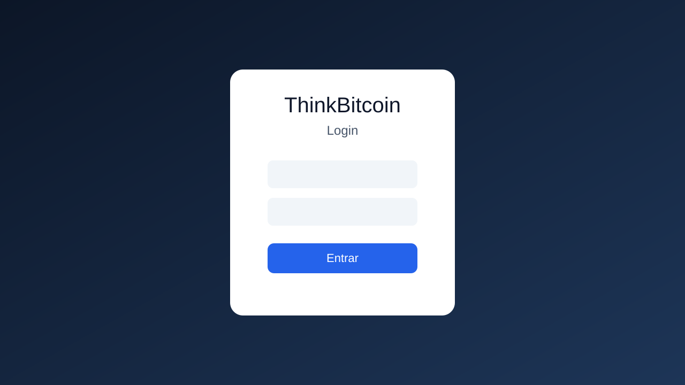
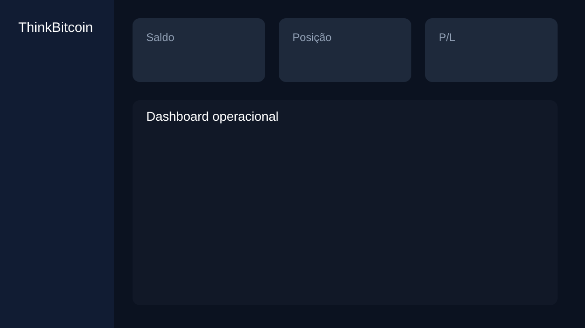
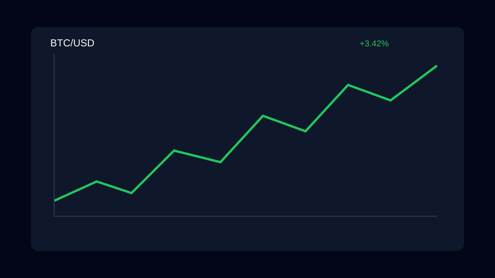

# ThinkBitcoin-Front

Aplicação web construída com React e Vite para acompanhar cotações de criptoativos, realizar autenticação e gerenciar preferências do usuário.

## Transparência sobre este repositório

⚠️ **Este repositório contém apenas o frontend.**  
A API e o motor de decisão do ThinkBitcoin são privados e não fazem parte deste código-fonte.

✔️ Este frontend funciona com dados mockados.  
✔️ Este frontend demonstra a interface do sistema ThinkBitcoin.

## Screenshots / GIF

Mesmo com backend privado, a experiência visual do produto pode ser avaliada por aqui:

### Login


### Dashboard


### Gráfico


### Decisão do bot


## Para quem está chegando agora
- **O que é o ThinkBitcoin-Front em 1 frase:** ThinkBitcoin-Front é um sistema experimental de trading com aprendizado por reforço, com uma interface web para acompanhar mercado, autenticação e configurações operacionais.
- **Por que esse projeto existe:** o projeto existe para transformar pesquisa e operação de estratégias em um fluxo mais claro, com dados visuais, automação e evolução contínua documentada.
- **Quem deveria usar isso:** pessoas desenvolvedoras, analistas e entusiastas de cripto que queiram testar, acompanhar e evoluir estratégias de forma estruturada.

## Visão Geral
- Interface responsiva com Material UI e gráficos em tempo real fornecidos pelo Chart.js.
- Suporte a autenticação com persistência de token e preferências armazenadas no navegador.
- Internacionalização com suporte para português e inglês.
- Utilização de *hooks* customizados para preços (`useCoinPrices`) e tradução (`useTranslation`).
- Planejamento evolutivo documentado no arquivo `ROADMAP.md`.

## Roadmap
- O roadmap completo de evolução do produto está em [`ROADMAP.md`](./ROADMAP.md), organizado em quatro fases:
  - Base do projeto e pipeline de entrega.
  - Painel operacional do robô trader.
  - Plataforma de pesquisa de estratégias.
  - Evolução de UX, gráficos e performance.

## Pré-requisitos
- Node.js 18 ou superior.
- npm 10 ou superior.

## Instalação (A partir da raiz do projeto)
```bash
cd src
npm install
```

## Configuração de Ambiente
Por padrão, o frontend já sobe em **modo demo funcional sem backend** durante o desenvolvimento local (`npm run dev`), usando dados simulados na camada de API.

Se quiser customizar, crie um arquivo `.env` dentro da pasta `src/`.

Exemplo:

```bash
VITE_API_URL=https://minerthinkbitcoin.com
VITE_USE_MOCK=true
```

- `VITE_USE_MOCK=true`: ativa o mock local da camada de API no frontend.
- Quando o mock está ativo, endpoints usados pela interface retornam dados fake (incluindo sinal do robô no formato `btc`, `decision` e `confidence`) sem depender do backend.
- `VITE_USE_MOCK=false`: força chamadas reais para a API (desativa o modo demo local).
- Se `VITE_USE_MOCK` estiver ausente, o app usa mock automaticamente em desenvolvimento (`npm run dev`) e usa API real em produção (`npm run build`/deploy).

## Scripts Disponíveis (Executar dentro de /src)
| Comando        | Descrição                                     |
|----------------|-----------------------------------------------|
| `npm run dev`  | Inicia o servidor de desenvolvimento do Vite. |
| `npm run build`| Gera a versão otimizada para produção.        |
| `npm run preview` | Visualiza localmente o *build* gerado.     |
| `npm test`     | Executa a suíte de testes com o Vitest.       |

## Estrutura Principal
```
src/
├─ src/
│  ├─ components/        # Componentes reutilizáveis (Layout, Modal, etc.)
│  ├─ context/           # Contextos globais (AuthContext)
│  ├─ hooks/             # Hooks customizados (tradução, preços)
│  ├─ lang/              # Arquivos de tradução
│  ├─ pages/             # Páginas principais da aplicação
│  └─ utils/             # Utilidades compartilhadas (enums, helpers)
├─ public/               # Recursos estáticos usados pelo Vite
└─ test/                 # Testes automatizados
```

## Padrões e Boas Práticas
- Utilize os utilitários presentes em `src/src/utils` para trabalhar com enums, autenticação (`authentication.js`), camada de API (`apiClient.js`), workflows de interface (`workflow.js`) e armazenamento de preferências.
- Sempre execute `npm test` antes de abrir um pull request.
- Novas traduções devem ser adicionadas em `src/src/lang/en.json` e `src/src/lang/pt.json`.
- Ao estender componentes que necessitam de internacionalização e apresentação de dados localizados (como a visualização geopolítica `GeoHeatmapView.jsx` ou o `CoinCarousel.jsx`), sempre mapeie as chaves correspondentes nos dicionários de idiomas e utilize as funções utilitárias do projeto (como o dicionário de mapeamento geográfico) para garantir a consistência técnica e polimento da interface.


## Depuração no VS Code
Foi adicionado o arquivo `src/.vscode/launch.json` com configurações prontas para depuração local:

- **ThinkBitcoin-Front: Vite (dev)**: inicia o servidor de desenvolvimento via `npm run dev`.
- **ThinkBitcoin-Front: Abrir no Chrome**: abre o app em `http://localhost:5173` com suporte a *breakpoints* no código React.
- **ThinkBitcoin-Front: Testes (Vitest)**: executa os testes (`npm test`) com depuração no terminal integrado.

> Dica: para essas configurações funcionarem sem ajustes, abra no VS Code a pasta `ThinkBitcoin-Front/src` (a que contém o `package.json`) e use a aba **Run and Debug** para selecionar uma configuração.

## DevOps

O projeto utiliza um fluxo de entrega contínua baseado em **Azure Pipelines** e **Vercel**.

- **Hospedagem:** [Vercel](https://vercel.com) (Frontend).
- **Pipeline de CI/CD:** [Azure Pipelines](https://azure.microsoft.com/en-us/products/devops/pipelines/) (localizado em `devops/azure-pipelines-front-deploy-vercel.yml`).
- **Domínio:** `minerthinkbitcoin.com` (integrado à Vercel).

### Fluxo de Deploy
1. Push para `develop` -> Deploy de Preview na Vercel.
2. Merge para `main` -> Deploy de Produção em `minerthinkbitcoin.com`.

### Estrutura devops/
Além do pipeline da Vercel, a pasta `devops/` contém recursos para deploy em containers:
- `devops/deploy`: scripts para Docker e Kubernetes (Minikube).
- `devops/helm`: charts para deploy no K8s local.
- `devops/azure-pipelines-front-build-image.yml`: pipeline legado para build de imagens Docker.

### Variáveis (Variable Group: `thinkbitcoin-secrets`)
Para o pipeline funcionar, as seguintes variáveis devem estar no Azure DevOps:
- `VERCEL_TOKEN`: Token de acesso à API da Vercel.
- `VERCEL_ORG_ID`: ID da Organização/Time na Vercel.
- `VERCEL_PROJECT_ID`: ID do Projeto na Vercel.
- `PROD_API_URL`: `https://minerthinkbitcoin.com` (URL do seu backend).

## Testes (Executar dentro de /src)
```bash
npm test
```
Os testes utilizam o Vitest e são executados em modo *headless*.

## Contribuição
As diretrizes oficiais de contribuição estão em [`./CONTRIBUTING.md`](./CONTRIBUTING.md).
